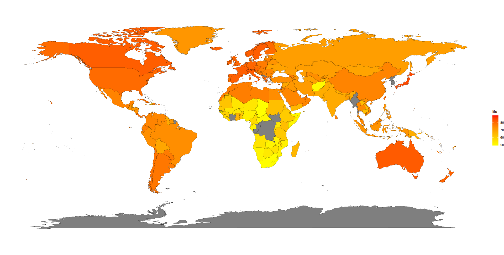

# Rashad Breaux
*Dat 2002*
**The Story of Gold**

***About this graph***
Here is a display of the value of gold spanning all the way from the year 1970 to more recent years, such as 2020. Early development of gold and the economy shows that the price of gold in the past would be viewed as a “cheap” commodity by today’s standards. You can also notice that the price of gold between the years 1990 and about 2005 started to even out and stagnate, but then, after that, closer to 2010, the price of gold skyrocketed. One of those possibilities could stem from the state of the domestic economy and geopolitical reasons. Displayed on this graph is the ratio between gold and silver. This was another thing I found interesting because silver slowly started to become more prevalent in comparison to gold in price, even as high as 80% in the later years from 2020 closer to the present day.
*Source*
Provided here is the link to the data that is displayed here.  

[link text](https://ingoldwetrust.report/chart-performance-table-gold-silver/?lang=en)

**Windspeed Data**

***About this graph***
Weather has many variables that can be measured, 2 of which are wind speed and temperature. Exactly placed here is a scatter plot displaying the relationship between the two in three different locations in the beautiful state of Colorado. Just looking at this scatterplot, I noticed a couple of things; one is between all three cities, as the temperature approaches 0 degrees Celsius, all the way to 20 degrees. The three locations have a relatively similar pattern. However, the city of Lamar does stand out as an outlier for the pattern. As the temperature increases, Lamar exponentially increases wind speed. Alamosa also breaks out the mold and has a massive increase in the middle temperatures. But Denver stays consistent the entire way. I do find this to be interesting because Denver is a more city/metropolitan area compared to Alamosa and Lamar. This fact, as well as population size, could play a part in why Denver is the only city that stays relatively in the middle of this entire scatterplot. 
*Source*

[link text](https://weatherspark.com/h/y/3709/2025/Historical-Weather-during-2025-in-Denver-Colorado-United-States)

**software sources**
Both graphs were created in RStudio, using the mplot function to present and manipulate each chart. 

